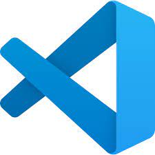
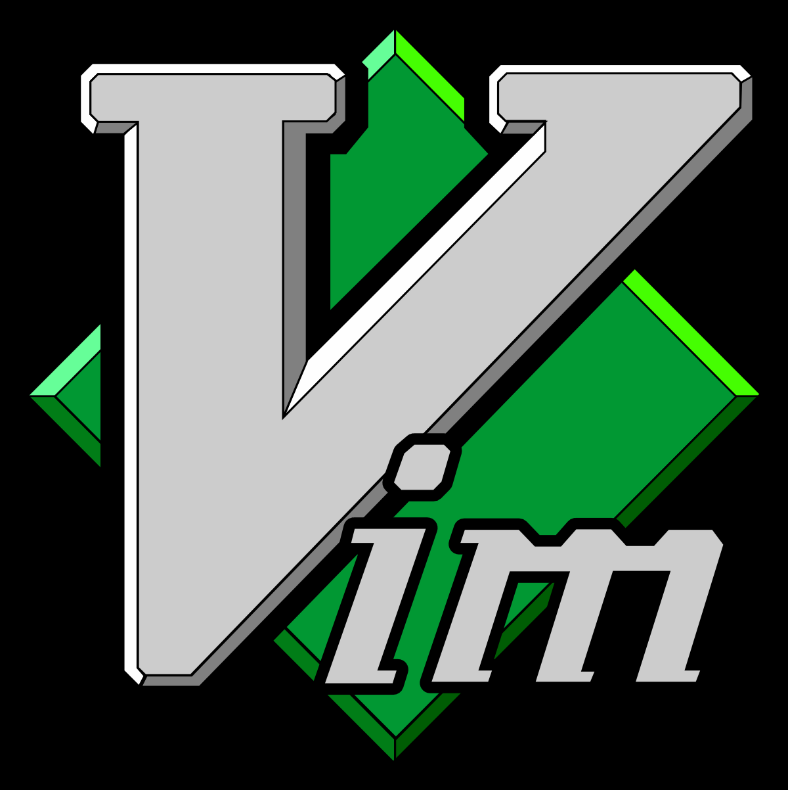

前言
===
Markdown是非常簡單好上手的工具，推薦大家都來使用Markdown來寫筆記，今天參考一位大大的部落格文章 [用 Markdown 寫技術文件 - 編輯工具與平台選擇](https://blog.darkthread.net/blog/tech-doc-with-hugo/) 來進行整理介紹。

IDE
===
現在目前主流都已經改用Visual Code了，畢竟他就是如此的好用及方便。如果需要用到Terminal來寫作的話，個人會使用vi、vim來做撰寫，但是通常vim我都是拿來純寫手稿而以，如果需要貼圖片等等功能還是會以vs code為主，所以等下都是以使用vs code 來實作。  



Extensions
===
為什麼那麼的推薦使用vs code呢?最大的原因就是在於vs code有許多的Extensions來去做使用，除了寫code之外寫markdown的文件也是非常的方便。  

Paste Image
---

寫作文件一定位想要圖文並茂對八!雖然markdown無法設定圖片的大小，但是如果需要插入圖片一般就是將圖片下載下來，然後放到資料夾在利用相對路徑來將圖片顯示出來，但是!!!如果你有Paste Image的話，一切就簡單許多，你只要複製你的圖片再到想要貼上的位置按下`ctrl + alt + b`就簡單快速的貼上圖片的路徑及下載圖片了。  
但是預設設定在貼上時是以當下文件路徑來去做貼上的，如果想要將圖片整合在一個位置(像筆者就是放在當前路徑的assets資料夾內)，你就必須做一些設定，如以下:  
```
"pasteImage.path": "${currentFileDir}/assets"
```
在`vscode`的`settings.json`加上這一行就有這樣的效果啦!加入後再貼上一次就發現它會自動幫你創好資料夾將圖片放入，連路徑都幫你設定好了呢!

Markdown All in One
---
非常非常方便的快捷鍵跟使用方式，加入後在你就可以像在寫word一樣，想要將文字粗體就框起來使用`ctrl + b`想要斜體就`ctrl + i`，一切的寫作都越來越方便了呢!