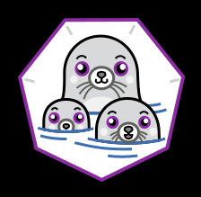

  

Podman
===
最近容器化技術越來越多人在使用，不只在開發上在應用的部屬上都有許多人在使用，而此技術目前大眾常用的都是使用`docker`這套軟體，但是因為docker在某些部分具有安全性及實用性的疑慮，有人便開發了一套另外的容器化軟體podman，來解決docker的一些不充足的部分。

安裝
===
podman安裝十分的簡單，以linux為例，如果是Ubuntu 20.10 以上的版本，可以直接下以下的指令安裝:
```
# Ubuntu 20.10 and newer
sudo apt-get -y update
sudo apt-get -y install podman
```
其他版本就要使用以下的指令安裝:
```
echo "deb https://download.opensuse.org/repositories/devel:/kubic:/libcontainers:/stable/xUbuntu_20.04/ /" | sudo tee /etc/apt/sources.list.d/devel:kubic:libcontainers:stable.list
curl -L "https://download.opensuse.org/repositories/devel:/kubic:/libcontainers:/stable/xUbuntu_20.04/Release.key" | sudo apt-key add -
sudo apt-get update
sudo apt-get -y upgrade
sudo apt-get -y install podman
```
安裝完後就可以使用以下指令確認安裝是否成功
```
podman -v
# or
podman info
```

基本指令
===
基本上來說podman的指令與docker幾乎一模一樣，如果會使用docker的人上手podman幾乎沒有負擔

```
podman search [options] TERM
# ex: podman search --filter=is-official python
```
這個指令用來搜尋image，可以加入 `--filter=is-official` 確認搜尋到的是否為官方製作的image

```
podman pull [options] IMAGE [IMAGE ...]
```
用來將遠端的image拉到自己的主機

```
podman run [options] IMAGE [COMMAND [ARG...]]
```
超級核心指令!!!製作基於IMAGE的container，這邊介紹幾個好用的options  
* `-i` : 互動模式
* `-t` : 開啟tty
* `-d` : 讓container背景執行
* `-v PATH:POD-PATH` : 將PATH套用在POD-PATH上
* `-p [HOST:]PORT:POD-PORT` : 可以將外部的PORT對應到container的PORT。  
※補充 : 使用 127.0.0.1:PORT 可以限定在localhost
* `--name NAME` : 幫container取名稱

```
podman ps
```
用來看現在主機的`正在啟動`的container的資訊
* `-a` : 看全部的container資訊